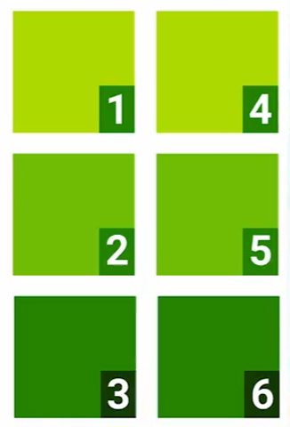
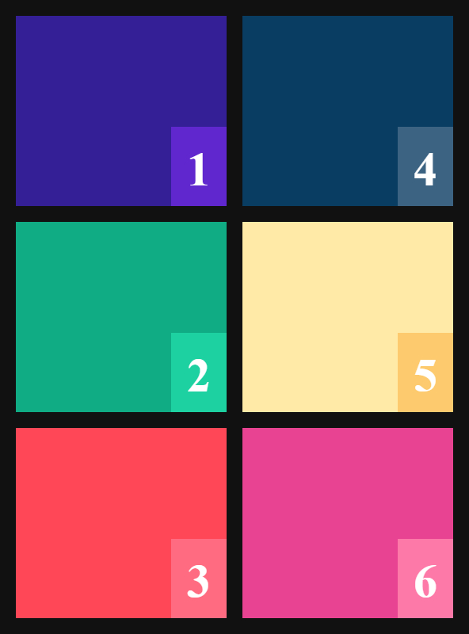
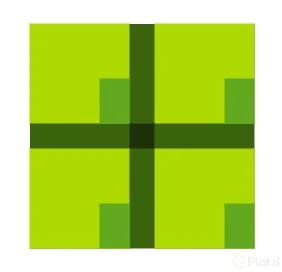
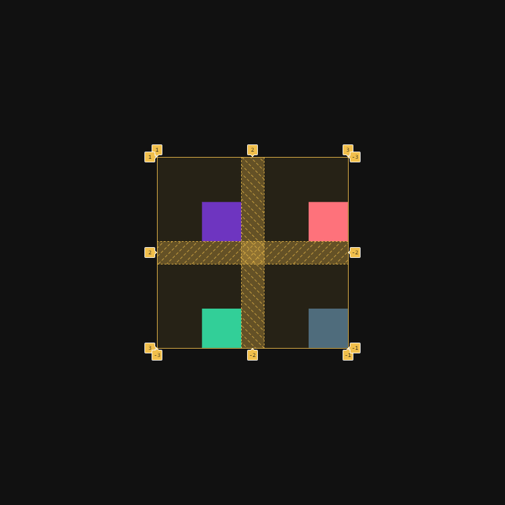
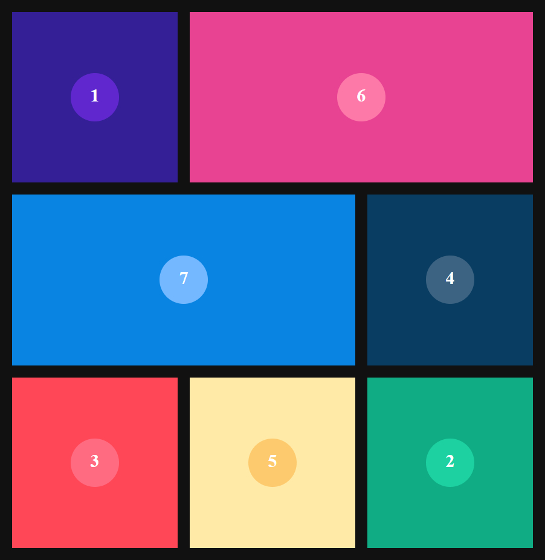

# **Curso de CSS Grid Básico**

## **Que es CSS Grid**

Es una especificacion de css que nacio por la necesidad para hacer layout mucho mas dinamicos. Antes de que existiera CSS grid para realizar una grilla se hacia el uso de tablas que volvian compleja hacer lo que se queria.

CSS grid agrega una cuadrilla entre columnas y filas permitiendo la manipulacion de los espacios, la alineacion, y la ubicacion de los elementos.

## **Conceptos para comenzar**

_Contenedor_ Es el elemento que se convertira en una grilla.

_Elementos_ Estan dentro del contenedor puede ser cualquier elemento HTML, al estar dentro del contenedor se convertiran en grid-items, esto quiere decir que obtendra propiedades de grid que nos ayudara a trabajar de forma optima en nuestra grilla.

_Lineas_ Son elementos que limitan o dividen las filas o columnas de nuestra grilla. Para una matriz 2x3 tenemos 4 lineas verticales y 3 horizontales, las verticales estan enumeradas de izquierda a derecha y las horizontales estan enumeradas de arriba hacia abajo.

_Celda_ es la unidad minima que podemos tener dentro una grilla, esta unidad esta delimitada por 4 lineas.

_Tracks_ Son grupos de celdas que estan en una misma fila o columna.

_Areas_ Son grupos que estan entre filas y comunas.

## **Propiedades del contenedor**

Las propiedades del contenedor nos permite crear una grilla definir la cantidad filas o columnas y definir el espaciado entre ellas:

```css
.contenedor {
  display: grid; // Habilita la grilla para el contenido
  grid-template-columns: 100px 200px 300px; // Creamos columnas, 3 columnas
  grid-template-row: 150px 250px; // Creamos filas, 2 filas
}
```

Si no sabemos cuantos elementos vamos a tener en nuestra grilla usamos la siguiente propiedad:

```css
.contenedor {
  display: grid;
  grid-auto-columns: 150px;
  grid-auto-rows: 100px;
}
```

Tenemos otra forma de llenar nuestra grilla, con la propiedad gri-auto-flow:

```css
.contenedor {
  display: grid;
  grid-auto-columns: 150px;
  grid-template-rows: 100px 200px;
  grid-auto-flow: columns; // Llena nuestra grilla priorizando las columnas
}
```

La propiedad gap permite crear un espaciado entre las celdas de la grilla.

```css
.contenedor {
  display: grid;
  grid-auto-columns: 150px;
  grid-template-rows: 100px 200px;
  grid-auto-flow: columns;
  row-gap: 10px; // Espaciado entre filas
  column-gap: 20px; // Espaciado entre columnas
  gap: 30px; // Espaciado entre filas y columnas
}
```

## **Reto uno**

Crear una grid de 3 filas y 2 columnas con un gap de 20px entre ellas. Los numeros de los items deben coincidir con la imagen a continuacion:



Esta es la [**solucion**](./reto-uno/index.html)


## **Propiedades de alineación**

Estas propiedades permite alinear nuestro elemento o nuestra grilla.

### **Propiedades de alineacion de los items**

Afecta a los items que contengan nuestra grilla

```css
.contenedor {
  display: grid;
  justify-items: Propiedad-de-alineacion; // Alineacion horizontal
  align-items: Propiedad-de-alineacion; // Alineacion vertical
  place-items: Propiedad-de-alineacion; // Alineacion horizontal y vertical
}
```

### **Propiedades de alineacion del contenedor**

Afecta directamente a la grilla

```css
.contenedor {
  display: grid;
  justify-content: Propiedad-de-alineacion; // Alineacion horizontal
  align-content: Propiedad-de-alineacion; // Alineacion vertical
  place-content: Propiedad-de-alineacion; // Alineacion horizontal y vertical
}
```

### **Propiedades de alineacion del item**

Afecta directamente al item

```css
.contenedor {
  display: grid;
  justify-self: Propiedad-de-alineacion; // Alineacion horizontal
  align-self: Propiedad-de-alineacion; // Alineacion vertical
  place-self: Propiedad-de-alineacion; // Alineacion horizontal y vertical
}
```

## **Reto dos**

Crear una grid de 2x2 donde los items se ubiquen en la esquina inferior derecha del contenedor, el contenedor debe estar centrado.



Esta es la [**solucion**](./reto-dos/index.html)


## **Propiedades de ubicación**

Podemos cambiar la ubicacion de nuestro elementos dentro de nuestra grilla, las propiedades que nos ayuda hacer esto son:

- Para las columnas

  - `grid-column`
  - `grid-column-start`
  - `grid-column-end`

- Para las filas

  - `grid-row`
  - `grid-row-start`
  - `grid-row-end`

- Areas
  - `grid-template-area`
  - `grid-area`
    Ejemplo de uso:

```css
.contenedor {
  background: #000;
  display: grid;
  grid-template-colum: repeat(3, 150px);
  grid-template-colum: repeat(3, 75px);
}
.item-uno {
  background: #fff;
  grid-column-start: 1; // Inicia en la primera linea
  grid-column-end: 4; // Finaliza en la cuarta linea
}

.item-dos {
  grid-row: 2 / 4; // Inicia linea 2 horizontal y termina linea 4 horizontal
}

.item-tres {
  grid-area: 2 / 2 / 4 / 4; // Inicia fila 2 / columna 2 y termina fila 4 / columna 4
}
```

Podemos extender el uso de las areas y simplificar nuestro codigo, ya que permite crear un template de como quedara nuestro codigo:

```css
.contenedor {
  background: #000;
  display: grid;
  grid-template-colum: repeat(3, 150px);
  grid-template-colum: repeat(3, 75px);
  grid-template-area:
    'header header header'
    'side main main'
    'side main main';
}
.item-uno {
  background: #fff;
  grid-area: header;
}

.item-dos {
  background: #fff;
  grid-area: side;
}

.item-tres {
  background: #fff;
  grid-area: main;
}
```

## **Reto tres**

Arma la siguiente grilla:


Esta es la [**solucion**](./reto-tres/index.html)


## **Funciones especiales**

### **minmax**

Esta funcion nos ayuda a declara el valor minimo y maximo para el ancho o alto de una celda. Esta funcion recibe 2 parametro, el primero es el valor minimo y el segundo el valor maximo.

```css
.contenedor {
  display: grid;
  grid-template-columm: minmax(30px, 300px);
}
```

### **repeat**

Nos permite repetir un valor las veces que deseemos. Son dos parametros que recibe, el primero es la cantidad a repetir el segundo el valor que se repetira.

```css
.contenedor {
  display: grid;
  grid-template-columm: repeat(3, 300px)
```

## **Keywords especiales**

- _fr_ es una unidad para dar ancho o alto a filas y columnas, fr es la cantidad de fracciones que vamos a otorgar.

- _min-content_ ajusta el ancho de la columna y ajustarla a su minima anchura.

- _max-content_ ajusta el ancho de la columna y ajustarla a su maxima anchura.

- _auto-fill/auto-fit_ estos keywords ayudan a ocupar el 100% del espacio disponible, auto-fill agrega columnas fantasma que rellena el espacio, auto-fit ajusta las columnas para que ocupen ese espacio.
