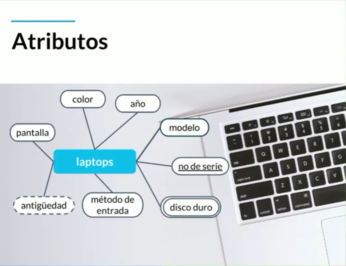
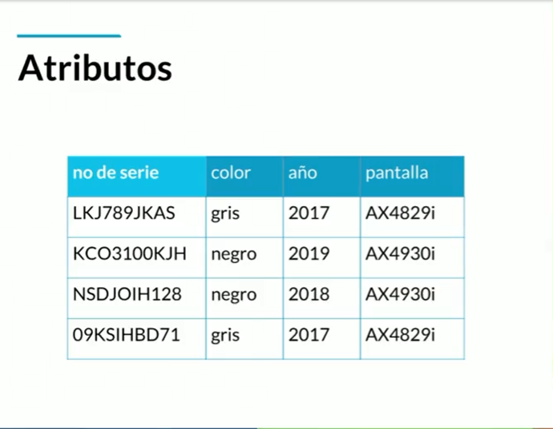
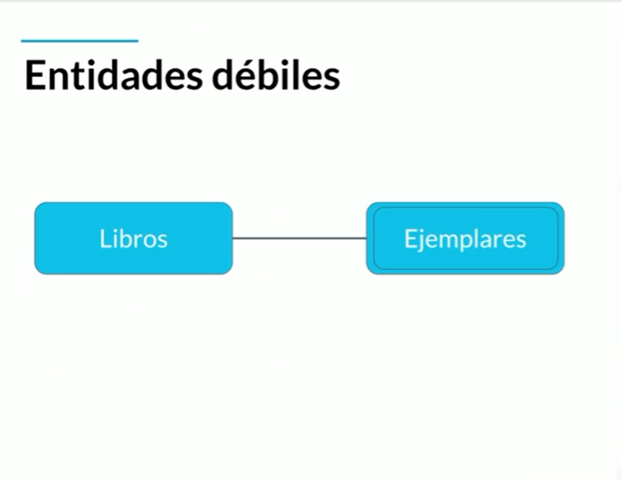

# **Historia de la persistencia de la información**
En la antiguedad la informacion se pasaba de boca en boca pero es inconsistente ya que distorciona la infomacion. 

Desde ese momento necesitaron guardar la informacion de forma que no cambiara y que persistiera a lo largo de los años. 

Aqui nacen los sistemas de escrituras primitivos iniciando por los sumerios llamada cuneiforme, tallaban la informacion en piedras y tablillas de arcillas. Eran dificiles de transportar y las tablillas eran muy debiles.

Como solucion llega los papiros y pergaminos, era muycho mas portatil y ligeros, su defecto era la forma en que se elavoraban ya que eran a base de materia animal o vegetal, por lo tanto se descomponian ya se por le paso del tiempo o por algun hongo.

Los chinos solucionarone el problema con la hoja de papel conservando la portabilidad y perservando su longevidad.

Hasta el siglo XX el almacenamiento de datos tuvo otra revolucion con el micro filme, pues su composicion hace que la informacion dure miles de años, su desventaja es que su manipulacion (editar la informacion, consultar la informacion) no es facil.

Luego llegan los medios digitales como los discos duros, los discos de estado solido y cds, estos medios usaron el formato de bits para almacenar la informacion.

La nube fue el siguiente paso en la evolucion del almacenamiento de datos, ya que podemos tener acceso a ella desde cualquier lugar del mundo, pueden hacer uso de la informacion al mismo tiempo.

## **Que son las bases de datos**
Las bases de datos nacen en el momento de la transicion de medios digitales a la nuben y complementan la arquitectura de John von Neumann.

Existe dos grupos de bases de datos : 

### **Bases de datos relacionales**
Emjemplos : Sql, Mysql, MariDB, Oracle y postgresql
### **Bases de datos no relacionales**
Ejemplos : Mongodb, Cassandra, Elasticsearch, neo4j

## **Servicios**
Tambien podemos dividir las bases de datos entre :

### **Auto administrados**
Es la base de datos que instalamos y nos encargamos del mantenimiento, configuracion, actualizaciones, parches y consistencia de datos.
### **Administrados**
Son servicios que ofrece las nubes modernas y este servicio es usado pero no gastamos recursos propios para su administracion.

# **Entidades y atributos**
Una entidad es un objeto representa algo en el mundo real, ya sea un ser vivo o un objeto, Las entidades se representan con un rectángulo.

Los atributos son las características que le otorga una identidad al objeto y son representados con óvalos.

En caso de tener múltiples veces el mismo atributo se representa con dos óvalos donde uno encierra al otro.

Si encontramos un atributo que necesita de otro atributo para ser existir, lo representamos con un ovalo con líneas punteadas.

Tomamos como ejemplo de entidad a una laptop y podemos deducir que sus atributos son :

- Color
- Pantalla
- Año venta
- Modelo
- Numero de serie
- Disco duro
- Método de entrada
- Antigüedad

El atributo **numero de serie** es un atributo llave y ayuda a identificar un elemento entre el grupo de elementos, en este caso entre el grupo de laptops. Este atributo es representado con una linea debajo de su nombre, dando la importancia necesaria.

## **Entidades fuertes**
No depende de otra entidad para existir.

## **Entidades débiles**
Necesitan de otra entidad para poder existir, son representada por dos cuadros donde uno encierra a otro.

Las entidades débiles existen por dos factores, por **identidad** ya que depende del atributo llave de la entidad "padre", para corregir o desligar las dos entidades, se otorga un identificador propio y solo seria una entidad débil por existencia.

Por **existencia**, quiere decir que la entidad débil no puede existir o usarse sin la entidad "padre".

# **Entidades de Platzi Blog**
Tomaremos como ejemplo el proyecto de platzi blog donde identificaremos las entidades con sus respectivos atributos.

- Post
  - Titulo
  - Fecha de publicación
  - Contenido
  - Estatus
  - Etiquetas
  - idPost
- Usuarios
  - login
  - Password
  - apodo
  - email
  - id
- Comentarios
  - Fecha de publicación
  - Contenido
  - idComentario
- Categorías
  - Nombre de la categoría
  - IdCategoria

## **Ejemplo personal**
Identificaremos las entidades y atributos para una **tienda de ropa**.

- Prenda
  - Nombre
  - Tipo
  - Precio
  - IdPrenda
- Compra
  - Cantidad de compra
  - Medio de pago
  - Valor prendas
  - Valor envió
  - IdCompra
- Datos de envió
  - Departamento
  - Ciudad
  - Barrio
  - Dirección
  - Teléfono
  - IdDatosEnvio
- Usuario
  - Nombre
  - Apellido
  - Correo
  - Apodo
  - Contraseña
  - IdUsuario