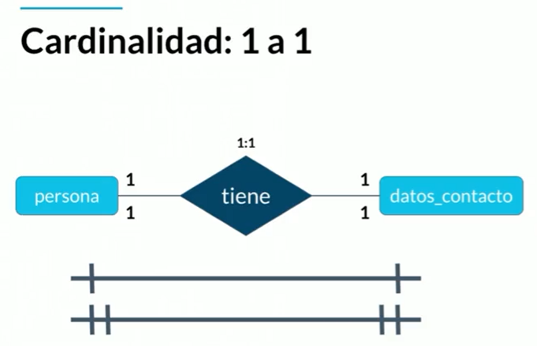
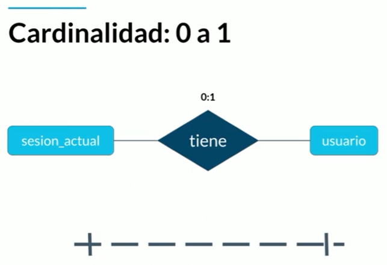
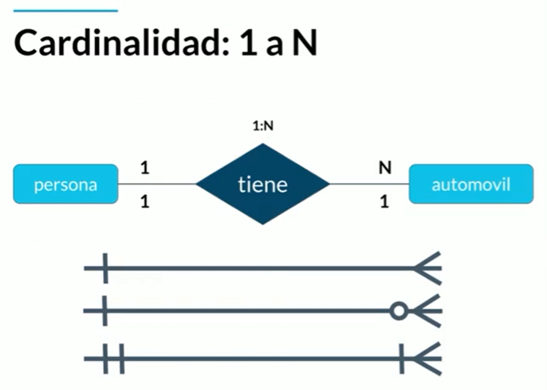
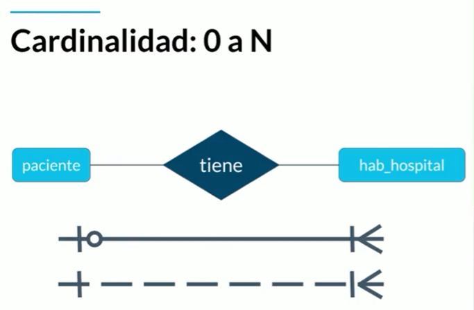
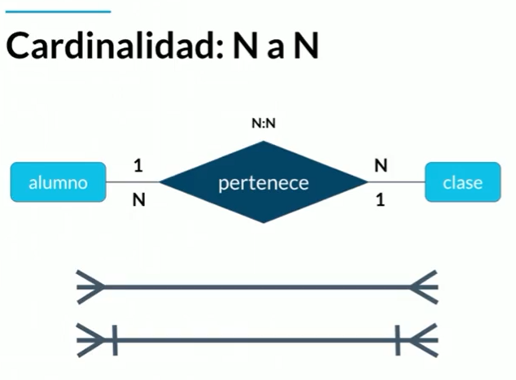
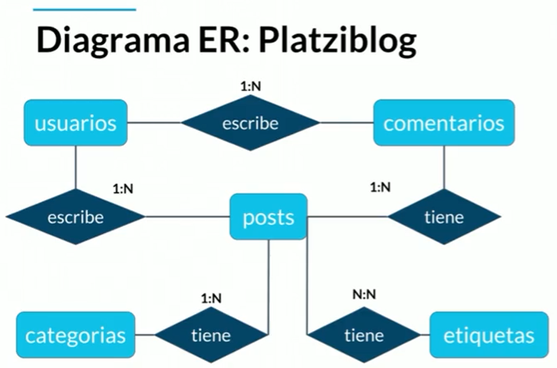

# **Historia de la persistencia de la información**
En la antiguedad la informacion se pasaba de boca en boca pero es inconsistente ya que distorciona la infomacion. 

Desde ese momento necesitaron guardar la informacion de forma que no cambiara y que persistiera a lo largo de los años. 

Aqui nacen los sistemas de escrituras primitivos iniciando por los sumerios llamada cuneiforme, tallaban la informacion en piedras y tablillas de arcillas. Eran dificiles de transportar y las tablillas eran muy debiles.

Como solucion llega los papiros y pergaminos, era muycho mas portatil y ligeros, su defecto era la forma en que se elavoraban ya que eran a base de materia animal o vegetal, por lo tanto se descomponian ya se por le paso del tiempo o por algun hongo.

Los chinos solucionarone el problema con la hoja de papel conservando la portabilidad y perservando su longevidad.

Hasta el siglo XX el almacenamiento de datos tuvo otra revolucion con el micro filme, pues su composicion hace que la informacion dure miles de años, su desventaja es que su manipulacion (editar la informacion, consultar la informacion) no es facil.

Luego llegan los medios digitales como los discos duros, los discos de estado solido y cds, estos medios usaron el formato de bits para almacenar la informacion.

La nube fue el siguiente paso en la evolucion del almacenamiento de datos, ya que podemos tener acceso a ella desde cualquier lugar del mundo, pueden hacer uso de la informacion al mismo tiempo.

## **Que son las bases de datos**
Las bases de datos nacen en el momento de la transicion de medios digitales a la nuben y complementan la arquitectura de John von Neumann.

Existe dos grupos de bases de datos : 

### **Bases de datos relacionales**
Emjemplos : Sql, Mysql, MariDB, Oracle y postgresql
### **Bases de datos no relacionales**
Ejemplos : Mongodb, Cassandra, Elasticsearch, neo4j

## **Servicios**
Tambien podemos dividir las bases de datos entre :

### **Auto administrados**
Es la base de datos que instalamos y nos encargamos del mantenimiento, configuracion, actualizaciones, parches y consistencia de datos.
### **Administrados**
Son servicios que ofrece las nubes modernas y este servicio es usado pero no gastamos recursos propios para su administracion.

# **Entidades y atributos**
Una entidad es un objeto representa algo en el mundo real, ya sea un ser vivo o un objeto, Las entidades se representan con un rectángulo.

Los atributos son las características que le otorga una identidad al objeto y son representados con óvalos.

En caso de tener múltiples veces el mismo atributo se representa con dos óvalos donde uno encierra al otro.

Si encontramos un atributo que necesita de otro atributo para ser existir, lo representamos con un ovalo con líneas punteadas.

Tomamos como ejemplo de entidad a una laptop y podemos deducir que sus atributos son :

- Color
- Pantalla
- Año venta
- Modelo
- Numero de serie
- Disco duro
- Método de entrada
- Antigüedad

El atributo **numero de serie** es un atributo llave y ayuda a identificar un elemento entre el grupo de elementos, en este caso entre el grupo de laptops. Este atributo es representado con una linea debajo de su nombre, dando la importancia necesaria.

## **Entidades fuertes**
No depende de otra entidad para existir.

## **Entidades débiles**
Necesitan de otra entidad para poder existir, son representada por dos cuadros donde uno encierra a otro.

Las entidades débiles existen por dos factores, por **identidad** ya que depende del atributo llave de la entidad "padre", para corregir o desligar las dos entidades, se otorga un identificador propio y solo seria una entidad débil por existencia.

Por **existencia**, quiere decir que la entidad débil no puede existir o usarse sin la entidad "padre".

# **Entidades de Platzi Blog**
Tomaremos como ejemplo el proyecto de platzi blog donde identificaremos las entidades con sus respectivos atributos.

- **Post**
  - Titulo
  - Fecha de publicación
  - Contenido
  - Estatus
  - Etiquetas
  - idPost
- **Usuarios**
  - login
  - Password
  - apodo
  - email
  - id
- **Comentarios**
  - Fecha de publicación
  - Contenido
  - idComentario
- **Categorías**
  - Nombre de la categoría
  - IdCategoria

## **Ejemplo personal**
Identificaremos las entidades y atributos para una **tienda de ropa**.

- **Prenda**
  - Nombre
  - Tipo
  - Precio
  - IdPrenda
- **Compra**
  - Cantidad de compra
  - Medio de pago
  - Valor prendas
  - Valor envío
  - IdCompra
- **Datos de envío**
  - Departamento
  - Ciudad
  - Barrio
  - Dirección
  - Teléfono
  - IdDatosEnvio
- **Usuario**
  - Nombre
  - Apellido
  - Correo
  - Apodo
  - Contraseña
  - IdUsuario

# **Relaciones**
La relaciones es la manera en la que empezamos a ligar nuestras diferentes entidades, se definen con verbos y estan representadas por un rombo.

Estas relaciones pueden tener una cardinalidad : 

## **De 1 a 1**

Según la imagen una persona tiene unos datos de contacto, y unos datos de contacto tienen que pertenecer a una persona. Esto quiere decir que una unidad de entidad solo puede pertencer a otra unidad de entidad.

Las lineas debajo del diagrama entidad relacion son representaciones de como se ve las relaciones en un diagrama fisico. Para nuestro ejemplo la primera linea representa la relacion 1 unidad tiene 1 unidad, pero la segunda representacion es mas extricto 1 unidad debe tener 1 unidad.

## **0 a uno**
Indica que la existencia de una unidad de entidad no depende de la otra unidad de entidad.

Un usuario puede tener una session abierta, y una session tiene un usuario. La representacion en el dragrama fisico es una linea punteada.

## **1 a N**

Una persona tiene muchos automoviles, pero un automovil puede pertenecer a una sola persona. 

Para la represencion en el diagrama fisico dice que puede tener 3 posibles variantes : 

la primera linea es una representacion normal.

la seguna indica que una de las entidades puede tener muchas unidades.

la tercera es mas extricta indica que una unidad debe tener minimo una unidad y maximo muchas unidades.

## **0 a N**

Un paciente debe estar en una habitacion de hospital, pero una habitacion puede tener a lo largo del dia tiene ninguno o varios pacientes.

# **Multiples muchos**

Un alumno tiene muchas clases y una clase tiene nuchos alumnos. Estas representacion es especial.

La representacion en el diagrama fisico tenemos una representacion normal y una representacion mas extricta donde siempre es muchos a muchos.

# **Diagrama Entidad Relacion**
Para el ejemplo platzyblog el diagrama entidad relacion seria :

- Cada **Usuario** escribe multiples **Posts**, pero un **Post** esta escrito por un solo usuario.

- Cada **Usuario** escribe multiples **Comentarios**, pero un **Comentario** esta escrito por un **Usuario**.

- Un **Post** tiene una **Categoria**, pero una **Categoria** tiene multiples **Post**.

- Un **Post** tiene multiples **Etiquetas**, pero una **Etiquetas** tiene multiples **Post**.

Para nuestro proyecto personal "Tienda de ropa" el diagrama seria de la siguiente manera : 

- Una **Compra** puede tener una o multiples **Prendas**, pero una **prenda** esta en una **Compra**.

- Una **Compra** tiene un **Usuario**, pero un **Usuario** puede tener una o multiples **Compras**.

- Un **Usuario** tiene multiple **Datos de envío**, pero un **Dato de envío** tiene un **Usuario**.

- Una **Compra** tiene un **Dato de envío**, pero un **Dato de envío** tiene multiples **Compra**.

# **Diagrama Físico: tipos de datos y constraints**
Antes de realizar nuestro diagrama físico debemos tener claro estos conceptos.
## **Tipos de datos**
### **Texto**
*CHAR(n)* : Es un tipo de datos que almacena caracteres, se usa en cadenas de caracteres estatica.

*VARCHAR(n)* : Es un tipo de datos que almacena caracteres, se usa en cadeas de caracteres dinamica, reserva un pequeño espacio en memoria y va creciendo hasta llegar a su maxima longitud. logitus maxima 255 caracteres.

*Text* : Nos permite guardar cadenas de caracteres muy amplias.

### **Numerico**
*INTEGER* : Guarda enteros y se utiliza en datos que se realizara alguna operacion.
*BIGINT* : Se declara cuando es numero entero demasiado amplio.
*SMALLINT* : Se declara cuando es numero entero penqueño cuando es menor a 99.

*DECIMAL(n,s)* y *NUMERIC(n,s)* : recibe dos parametros, el numero de decimales y despues la cantidad. y son utilizados para tener un numero mas preciso como valores de cierta moneda.

### **Fecha/hora**
Nos permite tener una fecha y hora con la cual permite saber cuando un registro fue creado, eliminado o actualizado.
*DATE* : Registra una fecha año, mes y dia.
*TIME* : Registra la hora.
*DATETIME* : Registra la fecha y hora con mucha mas precision. El rango admitido es 1000-01-01 00:00:00 a 9999-12-31 23:59:59.   
*TIMESTAMP* : Registra la fecha y hora con mucha mas precision. Su rango es de 1970-01-01 00:00:01 UTC a 2038-01-19 03:14:07 UT

## **Lógicos**
*BOOLEANO* : Solo guarda dos valores, puede ser true o false, 0 o 1. Se usa para saber si algo esta activo o desactivado.

## **Constraints (Restriciones)**
Significa quele añadiremos reglas a nuestra base de datos.
*NOT NULL* : Estamos indicado que un atributo de nuestra entidad no puede ir en blanco o nulo. Ejemplo una contraseña.

*UNIQUE* : Estamos indicado que los valores de que guardaran en un atributo son unicos. Ejemeplo un email de registro.

*PRIMARY KEY* : Es la mas importante, ya que estamos indicando que es un atributo clave o llave. Tiene como ventaja que es tiene como propiedades *NOT NULL* y *UNIQUE*. Tambien se usa para entrelazar una table con otra.

*FOREIGN KEY* : Es la llave foranea de una tabla que esta conectada con la *PRIMARY KEY* de otra tabla. Tiene las mismas caracteristicas de la *PRIMARY KEY* pero no debe ser unica ya que puede repetirse.

*CHECK* : Permite hacer una regla de negocio o caso de uso que nos esta pidiendo.

*DEFAULT* : Indicamos que el atributo tenga otro dato DEFAULT, ya que normalmente es nulo (NULL).

*INDEX* : Permite hacer mas busquedas mas rapidas, pero tiene como desventaja que cada datos nuevo debe volver a calcular sus indices.

# **Diagrama Físico: normalizando Platziblog**
